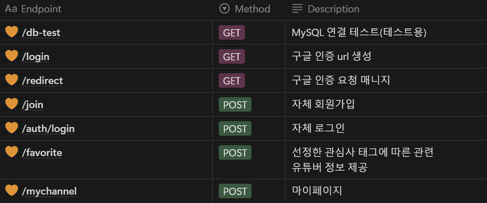
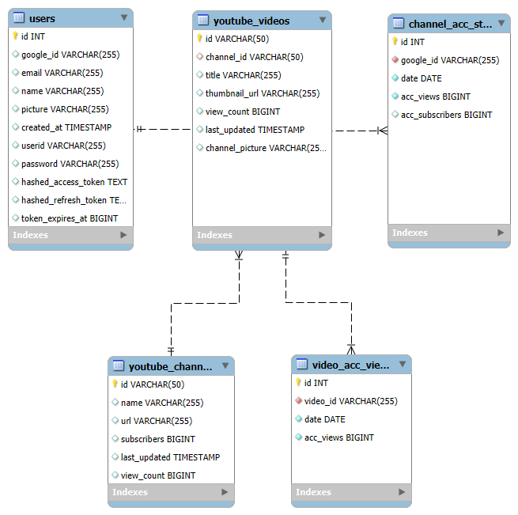

## Overview

최근 MZ 세대 사이에서 주목받는 장래 희망 중 하나는 의사나 판사가 아닌, 바로 **유튜버**입니다! MZ 세대는 개인의 성장과 행복을 중요하게 여기며, SNS와 같은 멀티미디어 플랫폼의 발달로 자신의 취미나 특기를 자연스럽게 공유하려는 경향이 강합니다. 이런 흐름 속에서 유튜버, 크리에이터, 인플루언서 같은 직업에 대한 관심과 수요가 급증하고 있습니다. **Youwithme**는 이러한 크리에이터들과 함께 성장하며, 유튜브 크리에이터를 위한 데이터베이스 제공 및 분석 플랫폼을 제공합니다.

---

## 팀원 및 개발 환경

- 조민지: EHWA CS 23

> **FE**
> 
> - Language : JavaScript
> - Framework: React
> 

- 이승민: KAIST CS 21

> **BE**
> 
> - Language: Javascript
> - Framework: Node.js
> - Database: MySQL

## 웹페이지 구조

### [ 주요 기능 ]

- 자체 회원가입 및 로그인 기능을 지원하며, 구글 소셜 로그인 기능 추가 지원
- Favorite 탭 이동 시 관심사 카테고리 및 세부 주제 선정을 통해 관련 유튜브 크리에이터들의 정보를 받아올 수 있음(Youtube Date API 이용)
- My Channel 탭 이동 시(구글 소셜 로그인이 선행되어야 함) 채널 정보 및 채널 통계, 업로드한 동영상별 통계가 누적 조회수 및 누적 구독자 수 그래프를 통해 표시됨
    
    → 그래프 on/off, 시간 조정, 동영상 선택 등 분석을 위한 다양한 기능 제공
    
    → 데이터의 경우 KST 오후 3시마다 Youtube reporting API를 이용해 갱신됨
    

## APIs

## DB

